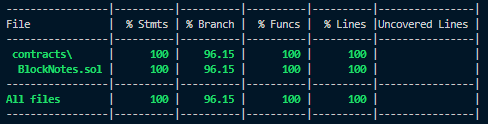

# BlockNotes - Solidity Smart Contract
## Overview

This repository contains a smart contract written in Solidity that functions as a simple digital notebook. The contract allows users to create, store, and share short notes. Users can manage the visibility of their notes by keeping them private, sharing them with specific users, or making them public for everyone to read.

The project also includes a test suite ensuring a minimum of 90% test coverage and optimizations for gas efficiency and security.


## Contract Details

- Contract Name: BlockNotesk
- Version: Solidity ^0.8.26
- Network: Ethereum Sepolia Testnet
- Deployed Address: Link to Etherscan (Replace with actual link to verified contract)

## Prerequisites

Before running or deploying the contract, make sure you have:

- Node.js and npm installed
- Truffle or Hardhat framework
- Solidity ^0.8.26
- Ganache for local testing or any Ethereum-compatible network.


## Contract Structure

### Visibility Enum

- Private: <br><i>Only the owner can read the note.</i>

- Shared: <br><i>The owner can share the note with specific users.</i>

- Public: <br><i>Anyone can read the note.</i>

### Mappings & Arrays

- Mapping: <br><i>Notes are stored in a mapping of noteId to Note struct.</i>

- User's Notes: <br><i>Each user has a list of their note IDs stored in a mapping of address to uint256[].</i>

### Functions

- createNote(string memory content, Visibility visibility):<br> <i>Creates a new note with specified visibility.</i>

- getNote(uint256 _noteId): <br> <i> Reads a note, respecting the visibility settings. </i>

- shareWith(uint256 noteId, address user): <br> <i> Shares a note with a specific address. </i>

- deleteNote(uint256 noteId): <br> <i> Deletes a note owned by the user. </i>

- changeVisibility(uint256 noteId, Visibility newVisibility): <br> <i> Allows the owner to change the visibility of a note. </i>

- receive(): <br> <i> Returns ether to users whom mistakenly sends funds to contract. </i> 


### Events

- NoteCreated(uint256 noteId, address owner)

- NoteShared(uint256 noteId, address sharedWith)

- NoteVisibilityChanged(uint256 noteId, Visibility newVisibility)

- NoteDeleted(uint256 noteId)

## Gas Optimizations

- Custom Errors: <br><i>Reduces gas costs by replacing string-based require messages with custom errors.</i>

- Efficient Storage Access: <br><i>Reduces gas by minimizing redundant storage reads in modifiers.</i>

- Mappings Instead of Arrays: <br><i>Optimizes user access control with O(1) lookups rather than more expensive dynamic array operations.</i>

## Fallback & Receive Functions

The contract includes a receive() function to handle any ETH sent to the contract. However, ETH handling is not a primary function of this contract.

## Installation

Clone the repository:

```bash
git https://github.com/nativealien/solidity-assignment.git
cd solidity-assignment
```

Install dependencies:

```bash
npm install
```

Compile the contract:

```bash
npx hardhat compile
```

Run the tests:

```bash
npm test
```

## Testing

Run the test suite to ensure the contract works as expected:

```bash
npx hardhat test
```

Ensure that test coverage is above 90% by running:

```bash
npx hardhat coverage
```



